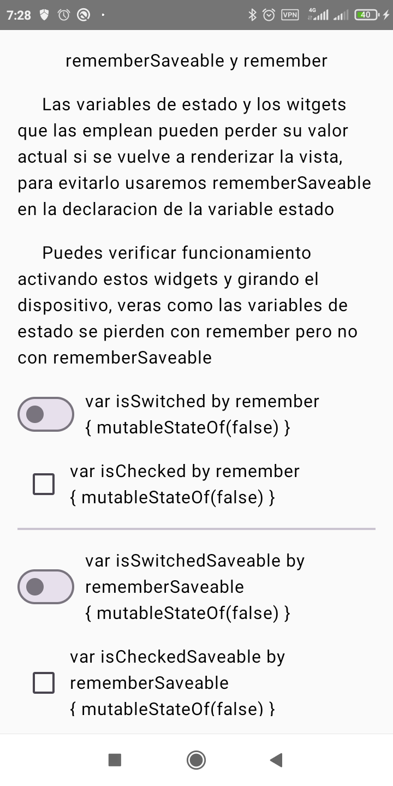
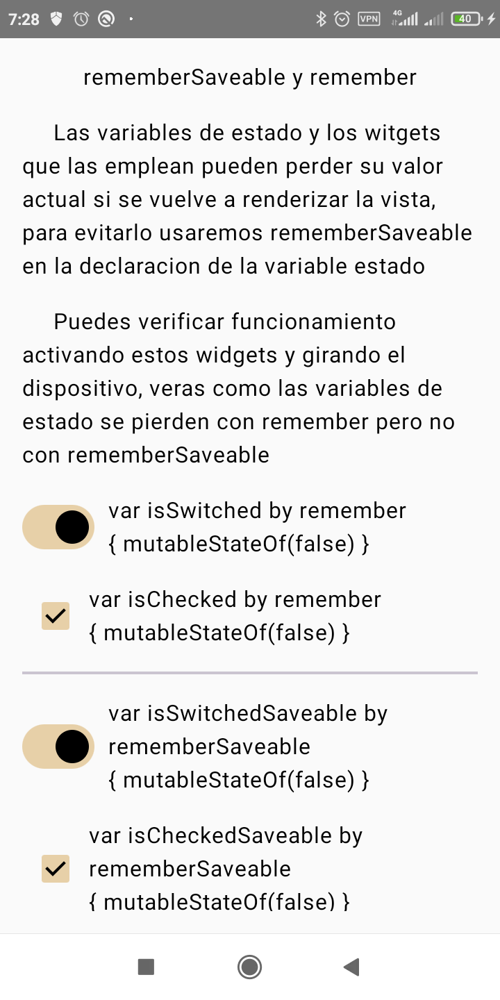
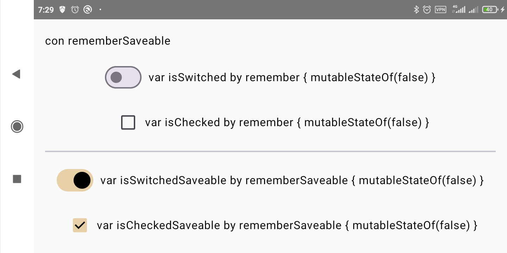

# Remember status en Jetpack Compose

UD2 Kotlin Jetpack Compose
La unidad 2 de Programacion MultiMedia (PMM) explica Jetpack Compose y su funcionamiento, he desglosado una serie de conceptos y creado apps minimas para facilitar su comprension.

## Acerca de RememberStatus
aplicación WidgetsDemo en Jetpack Compose muestra una interfaz centrada en el uso de widgets interactivos con el propósito de demostrar las diferencias entre remember y rememberSaveable en la gestión del estado de los componentes.

    
    
    

# Widgets Interactivos:

Switch y Checkbox con remember: Permiten activar o desactivar el estado, pero pierden el valor cuando se rota el dispositivo, ya que el estado solo persiste en la composición actual.
Switch y Checkbox con rememberSaveable: Al igual que los anteriores, pero su estado se conserva incluso al rotar el dispositivo, gracias a rememberSaveable.

##Funcionalidad Principal
El objetivo principal es que el usuario experimente la persistencia del estado en la interfaz de usuario al rotar el dispositivo, diferenciando cómo remember y rememberSaveable afectan a los valores de estado de los widgets.

Configuración de Vista Previa
La app incluye una función de vista previa (@Preview) que permite visualizar el diseño en un dispositivo simulado con el tema WonderTheme, facilitando así el desarrollo y las pruebas de la interfaz.